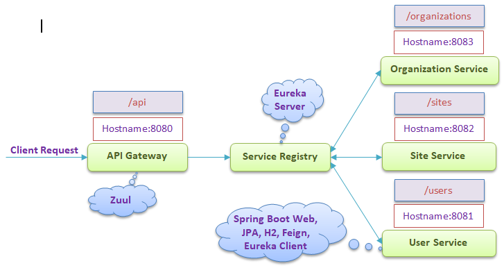
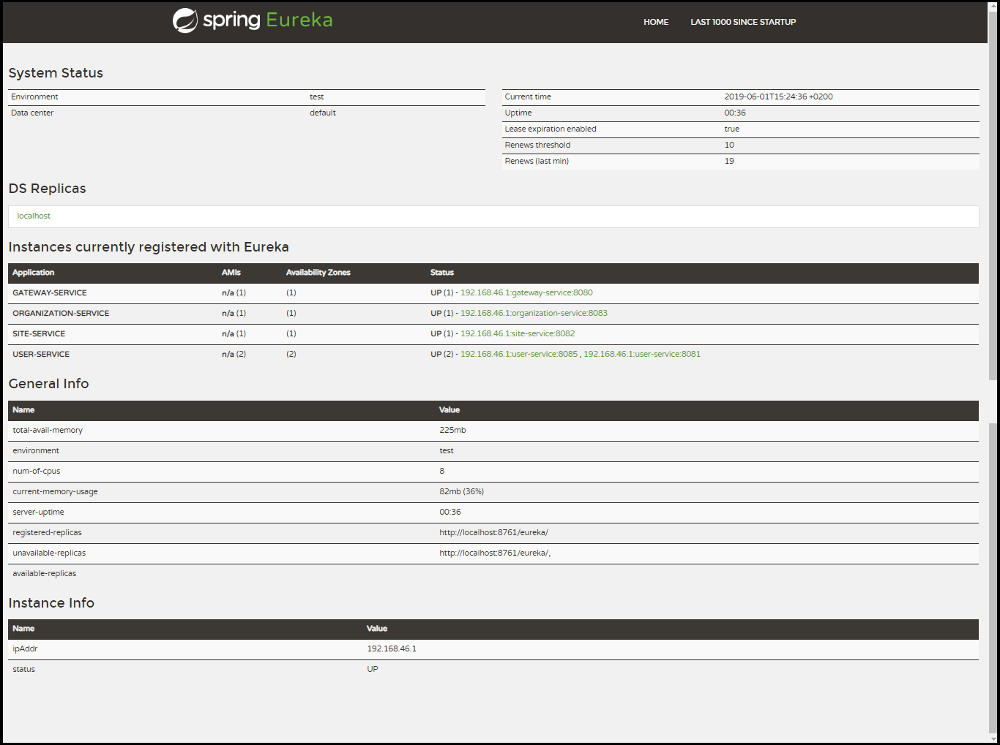

# Microservices-Sample-using-SpringBoot-SpringCloud-Eureka-and-Zuul
Spring Cloud project shows how to create simple microservices with Spring Boot, Spring Cloud, Eureka (Discovery Server) and Zuul (API gateway, Proxy, Load balancer)

## Table of contents
* [Architecture](#architecture)
* [Technologies](#technologies)
* [Getting Started](#getting-started)
* [Sample Requests](#sample-requests)
* [About me](#about-me)
* [Acknowledgments](#acknowledgments)

## Architecture
The project follows the *microservices* architectural style as in the next diagram



We have three independent microservices (User, Site, Organization), which register themself in service discovery (Eureka Server), and communicate with each other by declarative REST client (Open Feign). The whole system is hidden behind API gateway (Zuul).

## Technologies
This project is created using the following technologies:

1. Java 8
2. Spring Boot in cloud-native development:
	
	+ **Spring Cloud Netflix Eureka** – Registration and Discovery service for all microservices
	+ **Spring Cloud Netflix Zuul** – API Gateway service that provides dynamic routing, and load balancer
	+ **Spring Cloud Netflix Feign** – Declarative REST client
	
3. Spring Boot in microservices development:
	
	+ Spring Web
	+ Spring Data JPA
	+ Spring Devtools
	+ Spring Actuator
	+ H2 In-Memory database

4. Maven Dependency Management

## Getting Started

These instructions will get you a copy of the project up and running on your local machine for development and testing purposes. See deployment for notes on how to deploy the project on a live system.

### Prerequisites
You need to install the following software:
 * Java JDK 1.8+
 * Maven 3.0+

### Developing Steps
The steps to be taken in order to create working microservices-based system using Spring Cloud:
	
**Step 1.** Creating service discovery with Spring Cloud Netflix Eureka
 
**Step 2.** Building the microservices using Spring Boot, Spring Cloud and communication between them with Spring Cloud Open Feign:

 + User microservice
 + Site microservice
 + Organization microservice

**Step 3.** Creating API gateway using Spring Cloud Netflix Zuul

**Step 4.** Running and testing applications
 
### Setup
To run this project, install it locally as follow:

1. **Clone the application**

	```bash
	git clone https://github.com/SayedBaladoh/Microservices-Sample-using-SpringBoot-SpringCloud-Eureka-and-Zuul.git
	```

2. **Change the servers' port for the applications as per you want**

	Each application will start at the server on the port as specified in the previous `architecture diagram` by default.
	If you want to change the default `port` for the discovery service and the microservices

	+ open `src/main/resources/application.properties` file
	+ change `server.port` property

	For the API Gateway service you can change the default `port`

	+ open `src/main/resources/application.yml` file
	+ change `server.port` property	

3. **Run the service registry and discovery application**

	You can run the discovery service by typing the following command

	```bash
	cd discovery-service
	mvn spring-boot:run
	```
	
	The server will start on port `8761` by default, So once you have successfully started application you'll be able to visit the Eureka dashboard under address `http://localhost:8761`.
	
	If you changed the port in `src/main/resources/application.properties` file, use your custom port `http://localhost:port`.

4. **Run the User microservice application**

	You can run the user microservice by typing the following command

	```bash
	cd user-service
	mvn spring-boot:run
	```
	
	The user microservice will start on port `8081` by default, So you'll be able to visit the user microservice under address `http://localhost:8081`. 
	
	If you changed the port in  `src/main/resources/application.properties` file, use your custom port `http://localhost:port`.
	
	But we will use the address of **Zuul API Gateway** as a routing address for all microservice requests.

5. **Run the Site microservice application**

	You can run the site microservice by typing the following command

	```bash
	cd site-service
	mvn spring-boot:run
	```
	
	The site microservice will start on port `8082` by default, So you'll be able to visit the site microservice under address `http://localhost:8082`.
	
	If you changed the port in  `src/main/resources/application.properties` file, use your custom port `http://localhost:port`.

	But we will use the address of **Zuul API Gateway** as a routing address for all microservice requests.
	
6. **Run the Organization microservice application**

	You can run the organization microservice by typing the following command

	```bash
	cd organization-service
	mvn spring-boot:run
	```
	
	The organization microservice will start on port `8083` by default, So you'll be able to visit the organization microservice under address `http://localhost:8083`. 
	
	If you changed the port in  `src/main/resources/application.properties` file, use your custom port `http://localhost:port`.
	
	But we will use the address of **Zuul API Gateway** as a routing address for all microservice requests.	
	
7. **Run the API gateway application**

	You can run the Zuul API gateway service by typing the following command

	```bash
	cd gateway-service
	mvn spring-boot:run
	```
	
	The server will start on port `8080` by default, So once you have successfully started application you'll be able to visit API gateway under address `http://localhost:8080`.
	
	If you changed the port in `src/main/resources/application.yml` file, use your custom port `http://localhost:port`.
	
	**Zuul API Gateway will forward the request to the specific microservice based on its proxy configuration. Such request will also be load balances by ribbon client.**
	

8. **Package the applications**

	You can also package the applications in the form of a `jar` file and then run each application like so

	```bash
	cd service_directory
	mvn clean package
	java -jar target/service_name-0.0.1-SNAPSHOT.jar
	```
	
	+ *service_directory*: the directory of the service.
	+ *service_name*: the name of the service.

9. **Run additional instances from microservices**

	You can run more instances of the microservices (User, Site, Organization):
	
	* Using eclipse just edit run command of your application (Run configurations…) and add VM parameter `-DPORT=…` or `-Dserver.port=…`.
	
	* Or using the `-Dserver.port=…` argument with the command: `java -jar target/service_name.jar -Dserver.port=…`

	```bash
	java -jar target/service_name-0.0.1-SNAPSHOT.jar -Dserver.port=8085
	``` 
	
### Running

To access the applications use the following endpoints

* **Eureka Discovery Service**

	After running discovery-service, its monitoring console available on `8761` port.

	`http://localhost:8761`
	
	
	
	Now take a look on Eureka monitoring console: We’ve got one instance of Site and Organization microservices running on default ports (8082, 8083) and two instances of user microservice on (8081, 8085) ports registered on discovery server. 

* **API Gateway and Microservices**
		
	+ View info about `API Gateway` service `http://localhost:8080/actuator/info`
	
	+ Check Health for `API Gateway` service `http://localhost:8080/actuator/health`
		
	Zuul is configured to be available under its default port 8080 and it forwards requests:
	* From `/api/users/` path to `user-service` 
	* From `/api/sites/` path to `site-service`
	* From `/api/organizations/` path to `organization-service`
	
	 When URL `http://localhost:8080/api/users/1` is called several times the Zuul make load balanced between two instances of each user microservice instances.
	 Also when we shut down one of microservice instance we can take a look that it is unregistered from Eureka server dashboard.	

## Sample Requests
CURL GET command samples for different (User, Site, Organization) microservices using `Zuul API Gateway address`:

### User APIs
* Display info about User microservice
	
	```bash
	curl -X GET \
	'http://localhost:8080/api/users/actuator/info' \
	  -H 'accept: */*' \
	  -H 'cache-control: no-cache'
	```
	
* Check Health for User microservice

	```bash
	curl -X GET \
	'http://localhost:8080/api/users/actuator/health' \
	  -H 'accept: */*' \
	  -H 'cache-control: no-cache'
	```
	
* List all users
	
	```bash
	curl -X GET \
	'http://localhost:8080/api/users' \
	  -H 'accept: */*' \
	  -H 'cache-control: no-cache'
	```

* Find user by Id

	```bash
	curl -X GET \
	'http://localhost:8080/api/users/1' \
	  -H 'accept: */*' \
	  -H 'cache-control: no-cache'
	```
	
* Filter users by SiteId

	```bash
	curl -X GET \
	'http://localhost:8080/api/users/site/3' \
	  -H 'accept: */*' \
	  -H 'cache-control: no-cache'
	```
	
* Filter users by OrganizationId

	```bash
	curl -X GET \
	'http://localhost:8080/api/users/organization/1' \
	  -H 'accept: */*' \
	  -H 'cache-control: no-cache'
	```

### Site APIs

* Display info about Site microservice
	
	```bash
	curl -X GET \
	'http://localhost:8080/api/sites/actuator/info' \
	  -H 'accept: */*' \
	  -H 'cache-control: no-cache'
	```
	
* Check Health for Site microservice

	```bash
	curl -X GET \
	'http://localhost:8080/api/sites/actuator/health' \
	  -H 'accept: */*' \
	  -H 'cache-control: no-cache'
	```
	
* List all sites
	
	```bash
	curl -X GET \
	'http://localhost:8080/api/sites' \
	  -H 'accept: */*' \
	  -H 'cache-control: no-cache'
	```

* Find site by Id

	```bash
	curl -X GET \
	'http://localhost:8080/api/sites/1' \
	  -H 'accept: */*' \
	  -H 'cache-control: no-cache'
	```
	
* Filter sites by OrganizationId

	```bash
	curl -X GET \
	'http://localhost:8080/api/sites/organization/1' \
	  -H 'accept: */*' \
	  -H 'cache-control: no-cache'
	```
	
* Filter sites with users by OrganizationId

	```bash
	curl -X GET \
	'http://localhost:8080/api/sites/organization/1/with-users' \
	  -H 'accept: */*' \
	  -H 'cache-control: no-cache'
	```

### Organization APIs

* Display info about Organization microservice
	
	```bash
	curl -X GET \
	'http://localhost:8080/api/organizations/actuator/info' \
	  -H 'accept: */*' \
	  -H 'cache-control: no-cache'
	```
	
* Check Health for Organization microservice

	```bash
	curl -X GET \
	'http://localhost:8080/api/organizations/actuator/health' \
	  -H 'accept: */*' \
	  -H 'cache-control: no-cache'
	```
	
* List all organizations
	
	```bash
	curl -X GET \
	'http://localhost:8080/api/organizations' \
	  -H 'accept: */*' \
	  -H 'cache-control: no-cache'
	```

* Find organization by Id

	```bash
	curl -X GET \
	'http://localhost:8080/api/organizations/1' \
	  -H 'accept: */*' \
	  -H 'cache-control: no-cache'
	```

* Find organization with sites by Id

	```bash
	curl -X GET \
	'http://localhost:8080/api/organizations/1/with-sites' \
	  -H 'accept: */*' \
	  -H 'cache-control: no-cache'
	```
* Find organization with sites and users by Id

	```bash
	curl -X GET \
	'http://localhost:8080/api/organizations/1/with-sites-with-users' \
	  -H 'accept: */*' \
	  -H 'cache-control: no-cache'
	```

* Find organization with users by Id

	```bash
	curl -X GET \
	'http://localhost:8080/api/organizations/1/with-users' \
	  -H 'accept: */*' \
	  -H 'cache-control: no-cache'
	```

## About me

I am Sayed Baladoh - Phd. Senior Software Engineer. I like software development. You can contact me via:

* [LinkedIn+](https://www.linkedin.com/in/sayed-baladoh-227aa66b/)
* [Mail](mailto:sayedbaladoh@yahoo.com)
* [Phone +20 1004337924](tel:+201004337924)

_**Any improvement or comment about the project is always welcome! As well as others shared their code publicly I want to share mine! Thanks!**_

## Acknowledgments

Thanks for reading. Share it with someone you think it might be helpful.
